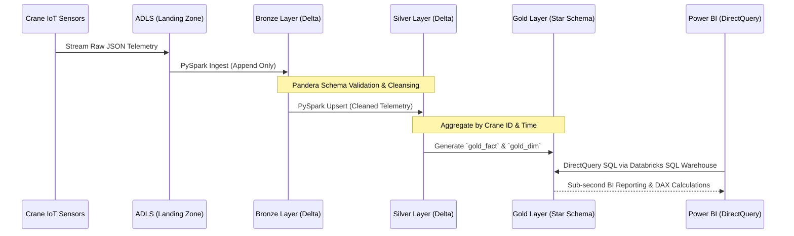

# AtlasLift-Telemetry-Lakehouse: Enterprise IoT Medallion Architecture

> **Ambitious Enterprise Data Platform** built with **PySpark**, **Azure Databricks**, **Power BI**, and **Databricks Asset Bundles (DABs)** — demonstrating expertise in **Medallion Lakehouse Architecture, FinOps Cluster Management, Infrastructure-as-Code (IaC), and Predictive Maintenance.**

<div align="center">
  
  [](#)
  [](#)

  <br />

  [](#)
  [](#)
  [](#)

  <br />

  [](#)
  [](#)
  [](#)

  <br />

  [](#)
  [](#)
  [](#)

</div>

AtlasLift transforms high-velocity, raw JSON IoT telemetry from global lifting equipment into a **highly structured, predictive analytics Star Schema**. Instead of relying on fragile, unversioned Databricks notebooks, this project treats the data pipeline as production software, utilizing isolated testing environments, strict CI/CD deployment gates, and declarative cloud infrastructure.

This project represents a **Lead-Level Analytics Engineering solution**, blending idempotent PySpark transformations, strict Medallion data quality enforcement, FinOps-optimized compute, and a DirectQuery Semantic Layer into a single, professional-grade product.

---

## Key Differentiators & Production-Ready Features

* **Medallion Lakehouse Architecture**
* Implements a strict Bronze (Raw), Silver (Cleansed), and Gold (Aggregated) progression. Data is decoupled and refined at each stage, culminating in a pristine Star Schema (`gold_fact` and `gold_dim`) optimized for BI consumption.
* **FinOps Model: Cost-Optimized Cloud Compute**
* Abandons expensive, always-on interactive clusters. Uses Databricks Asset Bundles to define a strict, ephemeral `Standard_D4s_v3` Single-Node job cluster with a 15-minute autotermination policy, protecting cloud budgets while delivering maximum PySpark throughput.
* **Enterprise CI/CD & Infrastructure as Code (IaC)**
* Completely eliminates UI-based deployments. Cloud infrastructure is provisioned via Azure Bicep. Pipeline code is continuously integrated via GitHub Actions, tested locally using a PySpark testing harness, and securely deployed to Azure using Databricks Service Principals.
* **Near Real-Time DirectQuery Semantic Layer**
* Bypasses traditional, slow Power BI imports. Connects directly to the Databricks SQL Warehouse via DirectQuery, feeding advanced DAX measures (Mean Time Between Failures, Critical Anomaly Flags) into the dashboard in near real-time.
* **Cross-Platform Developer Experience (DX)**
* Features a robust, Python-wrapped `Makefile` that flawlessly orchestrates Azure authentication, `.env` generation, and Databricks CLI commands identically across Windows, macOS, and Linux.

---

## System Architecture (Data Engineering Platform)

| Layer | Stack | Key Responsibilities |
| --- | --- | --- |
| **Ingestion (Landing)** | Azure Data Lake / JSON | Receiving raw, schema-less IoT telemetry messages from global crane assets. |
| **Processing Engine** | **Azure Databricks (PySpark)** | Distributed computing, Medallion layer processing, and Delta Lake ACID transactions. |
| **Data Quality** | Pandera | Strict dataframe schema enforcement, dropping malformed or physically impossible telemetry. |
| **Semantic Layer** | Power BI Desktop, DAX | DirectQuery Star Schema modeling, RLS governance, and calculating business metrics (MTBF). |
| **DevOps & IaC** | Azure Bicep, Databricks CLI, GitHub Actions | Provisioning workspaces, deploying Asset Bundles (`databricks.yml`), automated CI/CD. |

---

## Systems Engineering Highlights

| Component | Technical Achievement |
| --- | --- |
| **Idempotent Pipelines** | Engineered Silver and Gold layers using `MERGE INTO` Delta operations and overwrite protocols, ensuring the pipeline can be re-run infinitely without duplicating records. |
| **Cross-Platform CLI** | Built a custom Python wrapper (`generate_env.py`) to bypass Windows `cmd.exe` limitations, securely querying the Azure CLI to dynamically inject workspace URLs into the local `.env`. |
| **Predictive Maintenance** | Authored advanced DAX measures evaluating mechanical distress (Vibration > 45.0 mm/s, Load > 45,000kg) to flag `Total_Critical_Anomalies` for equipment managers. |
| **Row-Level Security (RLS)** | Applied dynamic `USERPRINCIPALNAME()` filtering in the Power BI semantic model, physically restricting Regional Service Managers to only query crane telemetry from their assigned jurisdictions. |
| **FinOps Pivot** | Dynamically refactored IaC templates to bypass Microsoft Azure "Sweden Central" `Standard_DS3_v2` capacity stockouts by pivoting to highly available `D4s_v3` SKUs. |

---

## System Workflow: Medallion Aggregation Pipeline



---

### List of Functionalities this project can do

* **Automated Data Seeding:** Automatically detects an empty landing zone and seeds mock Konecranes telemetry data (SMARTON, CXT models) to ensure pipeline testing capabilities.
* **Schema Evolution & Enforcement:** Drops physically impossible data (e.g., negative hoist loads) and prevents corrupted JSON payloads from poisoning downstream analytics.
* **Star Schema Generation:** Automatically normalizes flat, wide telemetry tables into highly efficient Fact and Dimension tables optimized for the Power BI VertiPaq engine.
* **Mean Time Between Failures (MTBF) Tracking:** Dynamically calculates crane operational health using advanced DAX based on a 5-minute operational ping assumption.
* **Dynamic Access Control:** Enforces strict regional data governance; a Nordic manager cannot physically view or query data from Central Europe equipment.
* **One-Click Cloud Deployment:** Run `make infra-up` to completely provision the required Azure Resource Groups and Databricks workspaces in under 5 minutes.
* **One-Click Tear Down:** Run `make infra-down` to safely destroy all cloud resources and protect billing credits when development concludes.

---

## Edge Cases & Expected Behavior (System Resilience)

AtlasLift is engineered to handle real-world cloud computing and data quality failures gracefully.

### Scenario 1: Azure Compute Capacity Stockouts

* **The Threat:** Microsoft Azure experiences a physical server shortage in the target region (e.g., `CLOUD_PROVIDER_RESOURCE_STOCKOUT`), crashing the Databricks cluster boot sequence.
* **System Response:** The Infrastructure as Code (`databricks.yml`) is abstracted. The architect simply updates the `node_type_id` to an available SKU (e.g., `Standard_D4s_v3`), commits the code, and GitHub Actions automatically re-deploys the updated cluster specification to Azure.

### Scenario 2: JVM Crash via `spark.stop()`

* **The Threat:** Local development habits (explicitly terminating the Spark context) cause fatal `SparkStoppedException` errors when deployed to managed Databricks job clusters.
* **System Response:** The orchestration layer (`src/main.py`) delegates lifecycle management entirely to the Databricks control plane, allowing the ephemeral job cluster to cleanly auto-terminate after 15 minutes of idle time.

### Scenario 3: Cross-Platform Execution Failures

* **The Threat:** Automation scripts (`Makefile`) relying on Bash sub-shells fail entirely when executed on a Windows machine by a new developer.
* **System Response:** All complex OS-level commands (Azure CLI queries, environment variable loading) are wrapped in strict Python subprocesses (`uv run python`), guaranteeing identical execution on Mac, Linux, and Windows.

---

## Setup & Run

This guide walks you through setting up and running **AtlasLift** locally and in Azure using the integrated **Makefile** Developer Experience (DX).

---

## Prerequisites

Ensure the following tools are installed on your system:

* **Python 3.11+** & **uv** Package Manager
* **Azure CLI** (Authenticated via `az login`)
* **Databricks CLI** (Installed and added to PATH)
* **Power BI Desktop** (Windows only, for semantic modeling)

---

## Quick Start (Cloud Execution)

The fastest way to provision the cloud infrastructure, generate your `.env`, and execute the PySpark pipeline is via the unified Makefile.

```bash
# 1. Install dependencies and local test harness via uv
make lock
make install

# 2. Provision the Azure Databricks Workspace (Requires active az login)
make infra-up

# 3. Pull Azure coordinates to build local .env file natively via Python
make generate-env

# 4. Execute the pipeline in the cloud
make run-pipeline

```

---

## Clean Up (FinOps)

To simulate a true enterprise tear-down and protect your cloud billing:

```bash
# 1. Destroy the Databricks cluster, jobs, and pipeline artifacts
make bundle-destroy

# 2. Asynchronously delete the Azure Resource Group
make infra-down

```

---

## Why It Matters

AtlasLift demonstrates **end-to-end Data Systems Engineering for Heavy Industry**. By moving beyond isolated notebooks and treating the data pipeline as version-controlled, testable, and CI/CD-integrated software, this project solves the scalability, reproducibility, and cost-control issues inherent to modern cloud analytics.

It’s designed to showcase the kind of **resilient architecture, FinOps awareness, and business-focused semantic modeling** that Konecranes expects from a **Lead Cloud Data Architect**.

---

## Built With

* **Python & PySpark** — Distributed data processing and schema enforcement.
* **Databricks Asset Bundles (DABs)** — Infrastructure as Code for Databricks.
* **Azure Bicep & CLI** — Cloud infrastructure provisioning.
* **Power BI & DAX** — DirectQuery Semantic Layer and predictive analytics.
* **GitHub Actions & Make** — CI/CD pipeline automation and cross-platform DX.

---

> **AtlasLift-Telemetry-Lakehouse** — A showcase of applied systems engineering, Medallion Architecture, and the power of turning raw IoT telemetry into industrial business value.